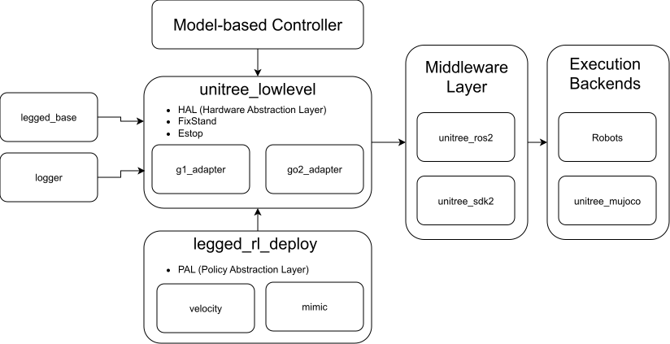

# Unitree Low Level

`unitree_lowlevel` is a low-level control layer for Unitree Go2 and G1 robots.
It reads robot state, runs a low-level control loop, exposes hooks for a user-defined high-level controller, and sends joint commands through the appropriate Unitree ROS 2 message adapter.

## Overview

### Architecture



This repository sits between the Unitree communication stack and your controller logic:

- [legged_base](https://github.com/Renkunzhao/legged_base.git)
  Shared utilities for legged robots, including timers, math helpers, interpolation, robot state containers, and Pinocchio-based kinematics and dynamics.
- `unitree_lowlevel` (this repository)
  Hardware abstraction layer (HAL) and controller entry point. It reads sensors, manages the gamepad state machine, provides emergency-stop handling and PD-based initialization, and forwards commands through the correct adapter for Go2 or G1.
- [unitree_sdk2](https://github.com/unitreerobotics/unitree_sdk2.git)
  Unitree's DDS-based SDK for Go2 and G1 communication.
- [unitree_ros2](https://github.com/unitreerobotics/unitree_ros2.git)
  ROS 2 message packages used to decode Unitree topics correctly.
- [unitree_mujoco](https://github.com/unitreerobotics/unitree_mujoco.git)
  Simulation environment with the same communication interface as the hardware, useful for controller validation before deployment.

Additional documentation in this repo:

- [Connection](Connection.md)
- [WIFI](WIFI.md)
- [Visualization](Visualization.md)
- [APT-SOURCE](APT-SOURCE.md)

For a reference high-level controller integration, see [legged_rl_deploy](https://github.com/Renkunzhao/legged_rl_deploy.git).

## Simulation Notes

The simulator and controller use the same Unitree ROS 2 messages. They must be started with the same `ROS_DOMAIN_ID`, RMW implementation, and network interface.

To run Unitree MuJoCo:

```bash
source src/unitree_lowlevel/scripts/setup.sh lo <ros-distro>
ros2 run unitree_mujoco unitree_mujoco
```

Once MuJoCo is running, start the controller node with the matching robot config in another terminal.

> Note: Unitree MuJoCo reads the installed `config.yaml`. With `--symlink-install`, it points directly to `src/unitree_mujoco/simulate/config.yaml`; otherwise rebuild after changing it. Set `use_joystick: 1` if you want joystick input.
>
> Note: Unitree typically uses `ROS_DOMAIN_ID=0` on hardware and recommends `ROS_DOMAIN_ID=1` for simulation. This repository keeps `ROS_DOMAIN_ID=0` for both, relying on different network interfaces such as `lo` for simulation and `eth0` for hardware.

## Installation

### 1. Clone the workspace

```bash
mkdir -p unitree_ws/src
cd unitree_ws/src
git clone https://github.com/Renkunzhao/unitree_lowlevel.git
```

The build script imports additional repositories into `src/` and `lib/`, so start from a workspace root as shown above.

### 2. Choose an environment

#### Option A: Docker

Install [Docker Engine](https://docs.docker.com/engine/install/ubuntu/) and the [NVIDIA Container Toolkit](https://docs.nvidia.com/datacenter/cloud-native/container-toolkit/latest/install-guide.html) first.

For Jetson-based onboard computers, update `docker/docker-compose.yaml` and replace:

```yaml
gpus: all
```

with:

```yaml
runtime: nvidia
```

Then build and enter the container:

```bash
cd unitree_lowlevel/docker
docker compose up -d --build
docker exec -it unitree_ws bash
```

Using the VS Code Dev Containers extension is recommended.

#### Option B: Native

Install ROS 2 first. This repository has been tested on Ubuntu 20.04, 22.04, and 24.04.

```bash
sudo apt install -y python-is-python3 python3-colcon-common-extensions libopenblas-dev python3-dev python3-vcstool libyaml-cpp-dev libspdlog-dev libboost-all-dev libglfw3-dev libfmt-dev python3-toml
sudo apt install ros-<ros-distro>-pinocchio ros-<ros-distro>-rmw-cyclonedds-cpp ros-<ros-distro>-rosidl-generator-dds-idl
```

### 3. Build the workspace

```bash
cd unitree_lowlevel
./scripts/colcon-config.sh <ros-distro> <Release|Debug>
```

This script:

- imports repositories listed in `scripts/lib.repos` and `scripts/src.repos`
- builds and installs `unitree_sdk2`
- downloads MuJoCo for simulation
- builds the ROS 2 workspace with `colcon`

## Runtime Setup

Before running hardware or simulation, configure the ROS 2 and DDS environment:

```bash
source src/unitree_lowlevel/scripts/setup.sh <network-interface> <ros-distro>
```

> Note: Follow [Go2-Doc](https://support.unitree.com/home/en/developer/Quick_start#heading-8) or [G1-Doc](https://support.unitree.com/home/en/G1_developer/quick_development#heading-7) to get network-interface.

This script sets:

- `WORKSPACE`
- `NetworkInterface`
- `ROS_DOMAIN_ID=0`
- `RMW_IMPLEMENTATION=rmw_cyclonedds_cpp`
- `CYCLONEDDS_URI` for the selected interface

Typical interface choices:

- `lo` for local simulation
- `eth0` or the robot-facing NIC for hardware

## Running the Controller

### Go2 hardware

Stop the default controller once after each boot:

```bash
source src/unitree_lowlevel/scripts/setup.sh <network-interface> <ros-distro>
$WORKSPACE/build/unitree_sdk2/bin/go2_stand_example <network-interface>
```

Then start the low-level controller:

```bash
ros2 run unitree_lowlevel unitree_lowlevel_node <network-interface> $WORKSPACE/src/unitree_lowlevel/config/go2.yaml
```

### G1 hardware

Follow the Unitree [G1 developer quick start](https://support.unitree.com/home/en/G1_developer/quick_start#heading-12) to enter `Debug Mode`, then run:

```bash
source src/unitree_lowlevel/scripts/setup.sh <network-interface> <ros-distro>
ros2 run unitree_lowlevel unitree_lowlevel_node <network-interface> $WORKSPACE/src/unitree_lowlevel/config/g1.yaml
```

> Note: The executable name is `unitree_lowlevel_node` for both robots. The actual robot adapter is selected from the YAML config file.

### Safety

When the node starts, it waits for confirmation before commanding the robot:

```text
WARNING: Make sure the robot is hung up or lying on the ground.
Press Enter to continue...
```

Do not skip this check during first bring-up or after changing gains, configs, or controller logic.

## Gamepad State Machine

The controller uses the following button mappings:

- `L2 + B`: emergency stop
- `SELECT + START`: clear emergency stop and return to `IDLE`
- `L2 + A` from `IDLE`: enter `FixStand`
- `L2 + A` from `FixStand`: enter `PreIDLE`, then return to `IDLE`
- `START` from `FixStand`: enter `HighController`
- `SELECT` from `HighController`: return to `FixStand`

`HighController` is the hook for user-defined higher-level logic. This repository provides the low-level loop, state handling, and robot I/O; it does not ship a task-specific high-level controller.

## Development

This repository uses `vcstool` to track workspace dependencies and `colcon` with CMake for builds.

To export the current dependency state:

```bash
cd $WORKSPACE
vcs export lib --exact > $WORKSPACE/src/unitree_lowlevel/scripts/lib.repos
vcs export src > $WORKSPACE/src/unitree_lowlevel/scripts/src.repos
```

Review the generated `.repos` files and remove unrelated repositories before committing updates.

## Optional Integrations

The repositories below are not required to build or run `unitree_lowlevel`, but this repository includes helper scripts and configuration to make integration easier.

### [unitree_rl_lab](https://github.com/unitreerobotics/unitree_rl_lab.git)

Reinforcement learning stack for Unitree robots based on Isaac Lab, with C++ deployment code.

```bash
source src/unitree_lowlevel/scripts/setup.sh <network-interface> $ROS_DISTRO

cd $WORKSPACE/lib
git clone https://github.com/unitreerobotics/unitree_rl_lab.git

cd unitree_rl_lab/deploy/robots/g1_29dof
mkdir build
cd build
source $WORKSPACE/src/unitree_lowlevel/scripts/unitree_sdk_path.sh
cmake .. && make -j$(nproc)
./g1_ctrl $NetworkInterface
```

### [unitree_rl_mjlab](https://github.com/unitreerobotics/unitree_rl_mjlab.git)

Reinforcement learning stack for Unitree robots based on MuJoCo, with C++ deployment code.

```bash
source src/unitree_lowlevel/scripts/setup.sh <network-interface> $ROS_DISTRO

cd $WORKSPACE/lib
git clone https://github.com/unitreerobotics/unitree_rl_mjlab.git

cd unitree_rl_mjlab/deploy/robots/g1
mkdir build
cd build
source $WORKSPACE/src/unitree_lowlevel/scripts/unitree_sdk_path.sh
cmake .. && make -j$(nproc)
./g1_ctrl $NetworkInterface
```
